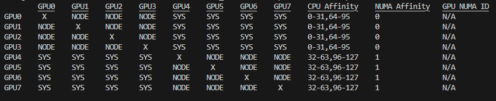
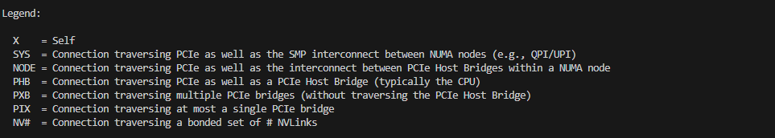

# Paper Title: Chimera: Communication Fusion for Hybrid Parallelism in Large Language Models

## Overview of Simulation Framework


## Directory Structure
1. src: contains all the source code and experimemt scripts for simulation
- communication: simulation code for communication part
    - backend: source code and config files of BookSim2 simulator
    - collective_communication: implementation of five collective communication patterns
- components: python interface to connect BookSim and ScaleSim-v2, and build the simulation framework
- computation: simulation code for computation part
    - backend: source code and config files of ScaleSim-v2 simulator
    - gpt2: model description and modeling of gpt2 and MoE models
- User/Chimera: contains the experiment scripts for baselines and fused LLM hybrid parallelism, as well as the picture scripts 
- utils: some other tool files
2. Real_Perf: contains all the source code and experimemt scripts for real machine tests
3. doc: some figures in README 

## Hardware Requirements:
1. For simulation experiments:
- One machine with Ubuntu 22.04 (Other Ubuntu version should work as well)
2. For real-machine tests:
- One 8&times;RTX4080 GPU node with PCIe 4.0 interconnection (Other machines can also work while the results vary with the machines and fabrics)

## Software Requirements:
1. For simulation experiments:
- Python 3.9
- ScaleSim-v2 and BookSim2 (We have already included both within this repository)
2. For real-machine tests:
- PyTorch 2.5.1
- CUDA 12.4
- NCCL 2.21.5

## Simulation Setup

### Update directory path

``` bash
python update_cfg.py
```


### Compile the source code

build a new conda environment 

``` bash
conda create --name Chimera python=3.9
conda activate Chimera
pip install -r requirements.txt
```
compile BookSim2
``` bash
cd ./src/communication/backend/booksim2/src
make libdbg
cd ../../../../../
```

## Reproduce the simulation results of the paper
``` bash
cd ./src/User/Chimera/experiment
source run-all.sh
```


## Reproduce the real-machine results of the paper
We use one 8&times;RTX4080 GPU node for the real machine tests which have the topology like below (use nvidia-smi topo -m). Different topologies could generate different results. 



To reproduce the real-machine test results
```bash
cd ./Real_Perf
source run_all.sh
```


## Reproduce all the pictures

To reproduce the pictures, please reproduce all the results before.
``` bash
cd ./src/User/Chimera/experiment/Pictures
conda activate Chimera
source plot-figure.sh
```
